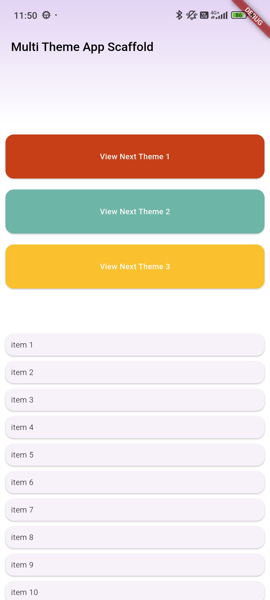

# 🌈 Flutter Multi-Theme App

A Flutter application showcasing **multiple themes** (light, dark, and custom themes) using a **custom AppScaffold** to maintain a consistent layout across the app.

---

## 📸 Screenshots

| Light Theme | Dark Theme | Custom Theme |
|--------------|-------------|---------------|
| (./assets/screenshots/home_screen2.png) |  | (./assets/screenshots/dynamic_theme3.png)  |

---

## ✨ Overview

This app is built to showcase how themes can be dynamically switched (Light, Dark, and Custom) while maintaining a unified look through a reusable scaffold.  
Each theme controls colors, typography, and gradient combinations, ensuring a consistent aesthetic experience.

---

## 🎨 Key Features

- 🌗 **Multiple Theme Support**  
  Switch seamlessly between Light, Dark, with Custom themes.

- 🧱 **Custom AppScaffold**  
  A unified layout component that maintains consistent AppBar, background, and structure across all screens.

- 🌈 **Gradient Design**  
  Gradient colors are applied to the AppBar, background, and key UI sections for a modern visual touch.

- 🪄 **Customized Status Bar**  
  Status bar color and icons are dynamically adjusted based on the active theme.  
  A gradient color is also applied to the status bar for a smooth visual transition with the AppBar.

- ⚡ **Dynamic Theme Switching**  
  Theme changes are reflected instantly across the entire app.

- 💾 **Persistent User Preference**  
  The selected theme is saved locally and restored when the app restarts.

---

